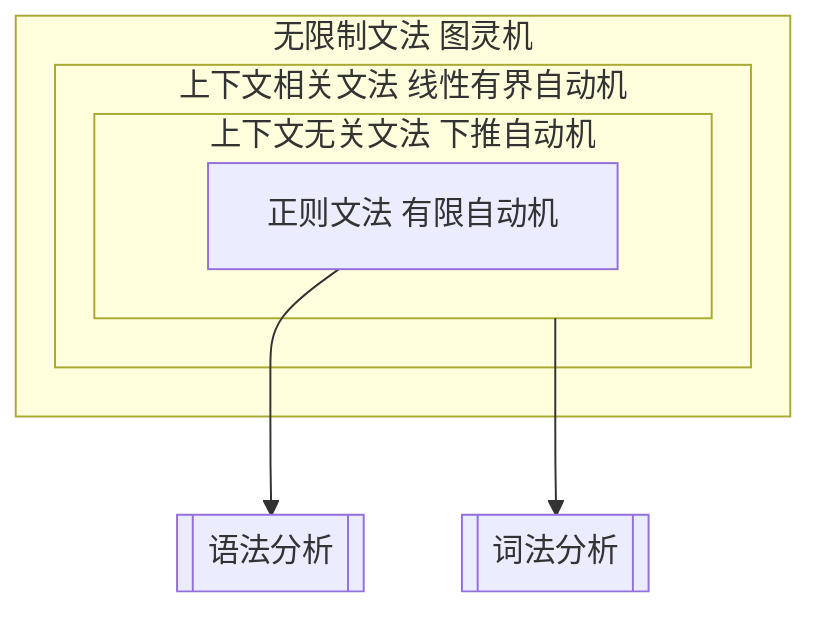
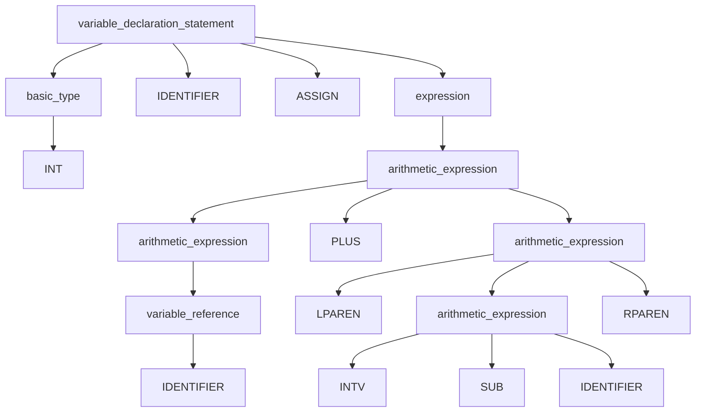
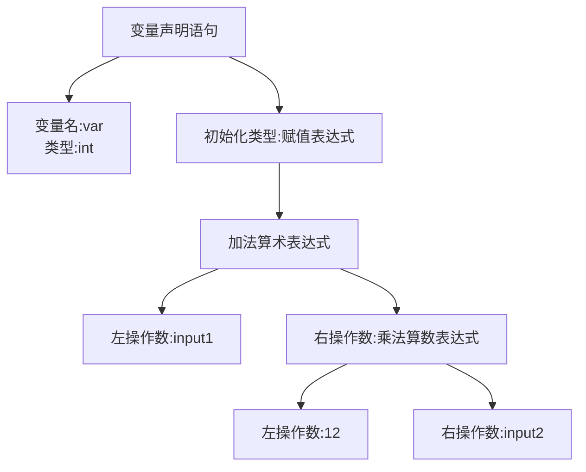

### 编译器前端原理与数据流分析培训

#### 1\. 引言

**什么是编译器？**

认知科学家史蒂芬·平克（Steven Pinker）。他在其著作《风格感觉》（The Sense of Style）中提到：“写作之难，在于将网状的思想，通过树状的句法，用线性的文字展开。” 

程序员的工作和作家类似，将网状的功能，通过树状的语法结构，用线性的代码展开。

编译器前端

* 编译器的组成：前端、优化器、后端
* 编译器的流程：源代码 -> 词法分析 -> 语法分析 -> 语义分析 -> 中间表示 -> 后端优化 -> 目标代码生成

**前端和数据流分析的定位**

* 前端的任务：将源码解析为结构化的中间表示（如抽象语法树）
* 数据流分析：优化代码和静态检查的核心

- - -

#### 2\. 编译器前端原理


### **总结表**

| **语言类型** | **生成语法** | **典型机器** | **描述能力** |
| ---- | ---- | ---- | ---- |
| **正则语言** | 正则文法（右/左线性） | 有限自动机 | 简单线性模式，无递归嵌套结构 |
| **上下文无关语言** | 上下文无关文法（CFG） | 下推自动机 | 嵌套递归结构（如括号匹配） |
| **上下文相关语言** | 上下文相关文法（CSG） | 线性有界自动机 | 复杂模式，需依赖上下文 |
| **递归可枚举语言** | 无限制文法（Unrestricted） | 图灵机 | 所有图灵可计算语言 |

这四种语法从简单到复杂逐步扩展，构成了形式语言与自动机理论的核心基础。

##### 2.1 词法分析（Lexical Analysis）

**目标**：将源码转化为Token流

* Token：语法的最小单位，例如关键字、标识符、操作符等
* 关键技术：正则表达式、有限状态机

**示例**：
输入代码：`int var = input1 + 12 * input2;`
输出Token流：`INT` -> `IDENTIFIER` -> `ASSIGN` -> `IDENTIFIER` -> `PLUS` -> `INTV` -> `MUL` -> `INTV` -> `SEMI`

工具：Lex、Flex

- - -

##### 2.2 语法分析（Syntax Analysis）

**目标**：生成抽象语法树（AST）

* 使用上下文无关文法（CFG）
* 常用解析算法：LL(1)、LR(1)

**示例：**   
输入代码：`int var = input1 + （12 - input2);`   
输出Token流：`INT` -> `IDENTIFIER` -> `ASSIGN` -> `IDENTIFIER` -> `PLUS` -> `LPAREN` -> `INTV` -> `SUB` -> `INTV` -> `RPAREN` -> `SEMI`   
对应 CST：
<!-- ```
variable_declaration_statement
|-- basic_type
|  |-- INT
|-- IDENTIFIER
|-- ASSIGN
|-- expression
    |-- arithmetic_expression
      |-- arithmetic_expression
      |  |-- IDENTIFIER
      |-- PLUS
      |-- LPAREN
      |-- arithmetic_expression
      |  |-- INTV
      |  |-- MUL
      |  |-- IDENTIFIER
      |-- RPAREN
``` -->

对应 AST：

工具：Bison、Yacc

- - -

##### 2.3 语义分析（Semantic Analysis）

**目标**：验证程序的语义合法性

* 符号表管理（变量、函数等）
* 类型检查

**示例：**
输入代码：`int x = "hello";`
错误提示：类型不匹配

- - -

#### 3\. 数据流分析原理

##### 3.1 数据流分析的定义

**目标**：通过静态分析代码，获取程序中变量的状态变化信息

* 常见应用：死代码检测、性能优化、静态错误检查

- - -

##### 3.2 数据流分析的框架

**控制流图 (Control Flow Graph, CFG)**

* 节点表示程序基本块
* 边表示控制流依赖

**算法框架：**

1. 初始化所有基本块的状态
2. 迭代更新状态，直到收敛

- - -

##### 3.3 常见的数据流分析

1. 活跃变量分析（Liveness Analysis）

* 确定变量是否在未来被使用

**示例代码：**

``` cpp
int a = 10;
b = a + c;
```

`a`是否需要保留，取决于是否在后续语句中被引用

2. 到达定义分析（Reaching Definitions）

* 确定哪些赋值语句对某变量有效

3. 使用-定义分析（Use-Definition Analysis）

* 确定每个变量使用的有效定义位置

- - -

##### 3.4 数据流分析实践

**示例：控制流图(CFG)**
代码：

``` cpp
if (x > 0) {
    y = x;
} else {
    y = -x;
}
```

生成的控制流图：

```
    [ x > 0 ]
       /   \
   y = x   y = -x
       \   /
       [end]
```

- - -

#### 4\. 实践与工具

##### 4.1 数据流分析工具

* Clang/LLVM工具链
* 使用Clang生成AST和中间表示（IR）

##### 4.2 实践练习

**练习 1：**

* 输入代码：

``` cpp
int x = 10;
int y = x + 5;
```

* 手动生成Token流和AST

**练习 2：**

* 构建简单的CFG
* 进行活跃变量分析

- - -

#### 5\. 总结与提问

**回顾内容**：

1. 编译器前端的主要任务：词法分析、语法分析、语义分析
2. 数据流分析的核心概念：活跃变量、控制流图、分析框架

**推荐学习资源**：

* “Compilers: Principles, Techniques, and Tools” (龙书)
* LLVM官方文档
* Clang静态分析教程

**问答环节**
